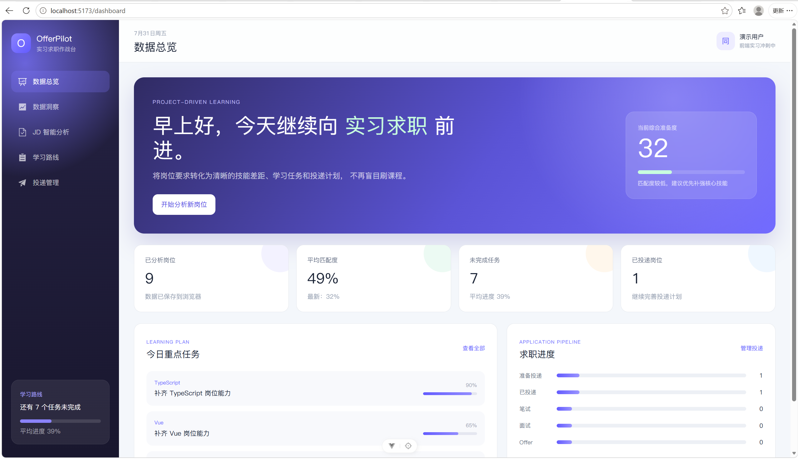
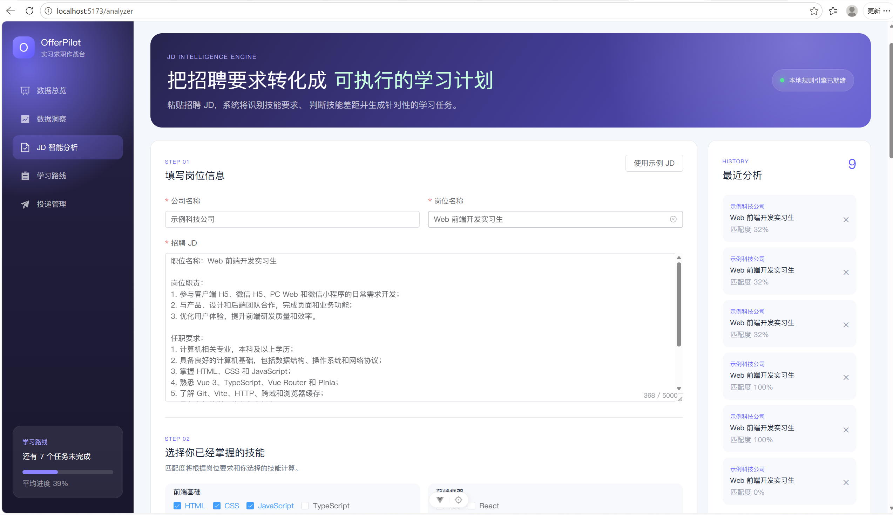
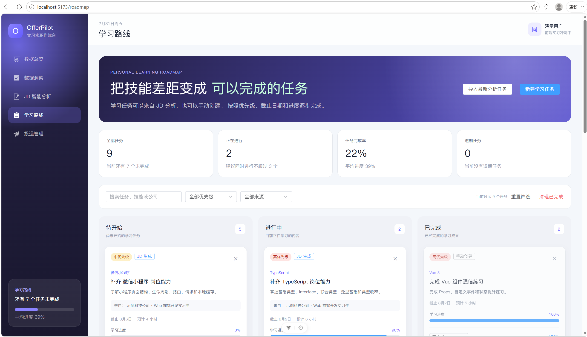
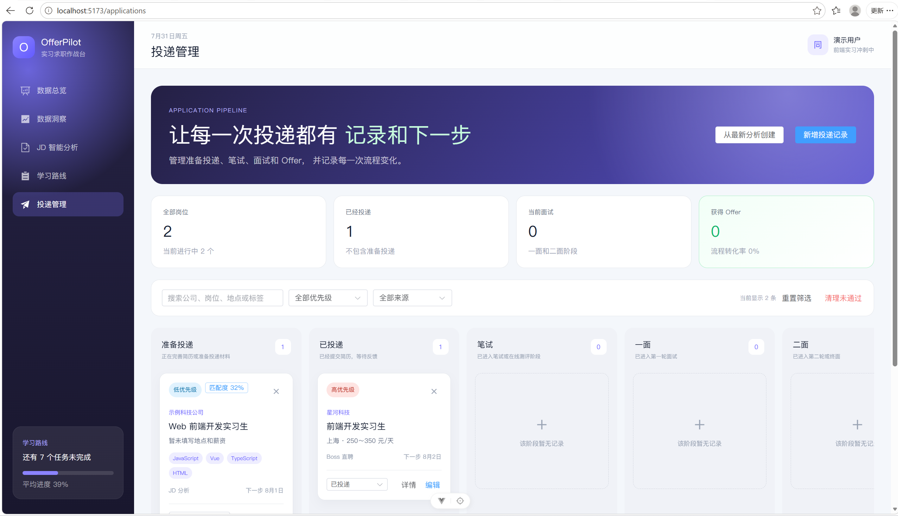
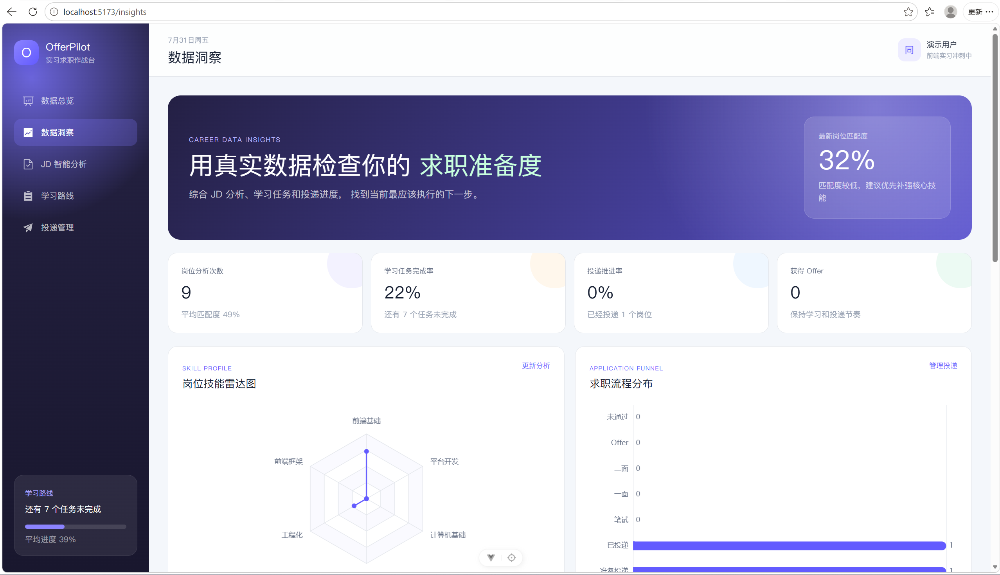

# OfferPilot 实习求职作战台

面向大学生的实习岗位分析、针对性学习和求职投递管理平台。

## 在线体验

- 在线地址：https://offer-pilot-hv7u.vercel.app
- GitHub：https://github.com/YyzAsia/offer-pilot

> 当前版本数据保存在浏览器 localStorage 中，不同浏览器之间的数据互不共享。可以通过数据洞察页面导出和导入 JSON 备份。

## 项目截图

### 数据总览



### JD 智能分析



### 学习路线



### 求职投递看板



### 数据洞察



## 项目介绍

OfferPilot 将求职过程中的岗位分析、技能学习和投递管理集中到同一个平台。

用户可以粘贴招聘 JD，系统会基于关键词字典和技能权重识别岗位要求，计算当前匹配度，并根据缺失技能生成学习任务。完成准备后，可以通过投递看板管理笔试、面试和 Offer 进度。

## 核心功能

- JD 技能关键词识别
- 必备技能与加分技能区分
- 岗位匹配度计算
- 待补技能和学习任务生成
- 学习任务看板
- 任务优先级、进度和截止日期
- 求职投递流程看板
- 投递状态历史记录
- 搜索和多条件筛选
- ECharts 数据可视化
- 项目数据导出和导入
- PC 与移动端响应式适配

## 技术栈

- Vue 3
- TypeScript
- Vite
- Vue Router
- Pinia
- Element Plus
- ECharts
- LocalStorage
- Git / GitHub
- Vercel

## 主要技术实现

### JD 分析规则

项目维护前端技能关键词字典，并为不同技能设置权重。

系统会：

1. 将招聘 JD 拆分成句子。
2. 查找技能关键词。
3. 判断技能属于必备项还是加分项。
4. 根据用户掌握情况计算加权匹配度。
5. 根据缺失技能生成学习任务。

### 数据状态管理

项目分别使用 Pinia 管理：

- JD 分析历史
- 学习路线任务
- 求职投递记录

当前前端版本通过 localStorage 完成持久化。

### 学习路线

学习任务支持：

- 待开始、进行中和已完成状态
- 电脑端拖动
- 手机端下拉框切换状态
- 任务进度、优先级和截止日期
- 搜索和筛选
- 逾期提醒

### 投递管理

投递记录支持：

- 准备投递
- 已投递
- 笔试
- 一面
- 二面
- Offer
- 未通过

每次状态变化都会生成流程历史记录。

### 数据可视化

数据洞察页面包括：

- 岗位技能雷达图
- 求职流程柱状图
- 学习任务状态环形图
- 最近 7 天活动趋势图

## 本地运行

```bash
git clone https://github.com/YyzAsia/offer-pilot.git

cd offer-pilot

npm install

npm run dev